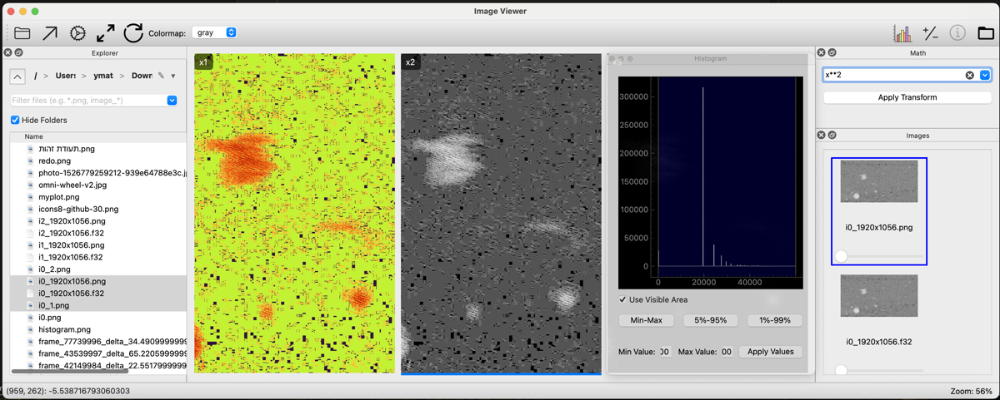

# ImageViewer: A Professional Image Analysis Tool

ImageViewer is a powerful, cross-platform desktop application for viewing and analyzing scientific and standard image formats. Built with Python and PyQt6, it provides a fluid, multi-window interface packed with features designed for in-depth image comparison and analysis.



---

## Key Features

### 1. Robust File Exploration & Navigation
- **Smart File Explorer:** A dedicated pane with breadcrumb navigation, folder history, and advanced filtering.
- **"Hide Folders" Filter:** Easily toggle folder visibility in the explorer to focus strictly on image files.
- **Synchronized Navigation:** Guaranteed image presentation during rapid browsing—no more skipped files when navigating with arrow keys.
- **Context-Aware Up-Navigation:** Automatically re-selects the previously exited subfolder when navigating up the directory tree.

### 2. Advanced Image Viewing & Raw Support
- **Wide Format Support:** Natively opens standard formats (PNG, JPEG, TIFF) and specialized raw data formats (`.raw`, `.f32`, `.uint8`, etc.).
- **Smart Raw Inheritance:** Automatically inherits parameters (resolution, dtype) between similar raw files while gracefully falling back to resolution guessing on mismatches.
- **Interactive Zoom & Pan:** Smooth, mouse-based zooming and panning centered around the cursor.
- **Multi-Window Interface:** Open multiple independent windows (`Ctrl+N`) with a robust lifecycle management to prevent crashes.

### 3. Real-Time Analysis & Metadata
- **Live Info Pane:** Scrub rows, columns, and data types with immediate, frame-by-frame visual feedback. No more debounce delays.
- **Live Histogram:** A dockable histogram updates in real-time. Performance-optimized to skip processing when the pane is hidden.
- **Interactive Contrast Stretching:** Drag the histogram bars or apply global stretches (Min-Max, 5%-95% percentiles).
- **Math Transforms:** Apply complex mathematical operations to image data using NumPy expressions (e.g., `np.log(x)`) via a dedicated smart-resizing pane.
- **Colormaps:** Instantly apply standard colormaps like `viridis` or `turbo` to single-channel or multi-channel data.

### 4. Comparison View (Montage)
- **Thumbnail Pane:** Dockable pane showing all open images for quick selection.
- **Montage Layout:** Compare multiple images side-by-side in a synchronized grid.
- **Synchronized Viewport:** Zooms and pans are instantly reflected across all images in the montage.
- **Synchronized Crosshair:** Press `c` to toggle crosshairs and see per-image pixel values in the status bar.

---

## Installation & Usage

1.  **Clone the repository:**
    ```sh
    git clone https://github.com/yakirma/ImageViewer.git
    cd ImageViewer
    ```

2.  **Install dependencies:**
    ```sh
    pip install -r requirements.txt
    ```

3.  **Run the application:**
    ```sh
    python main.py
    ```

---

## Keyboard Shortcuts

| Shortcut | Action |
| :--- | :--- |
| `Ctrl+N` | Open a new ImageViewer window. |
| `Ctrl+O` | Open file dialog. |
| `M` | Apply Min-Max contrast stretch. |
| `Shift+M` | Apply 5%-95% percentile contrast stretch. |
| `C` | Toggle synchronized crosshair in montage. |
| `Backspace` | Navigate up one folder level in File Explorer. |
| `Enter` | Dive into folder or open file in File Explorer. |
| `Arrow Up/Down` | Navigate files/thumbnails. |

---

## Building

Created standalone executables using:
```sh
python build.py
```

