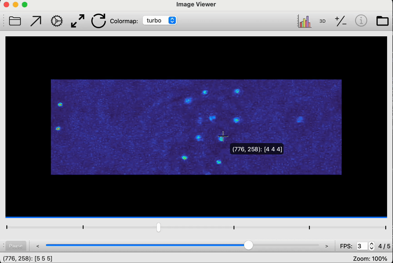
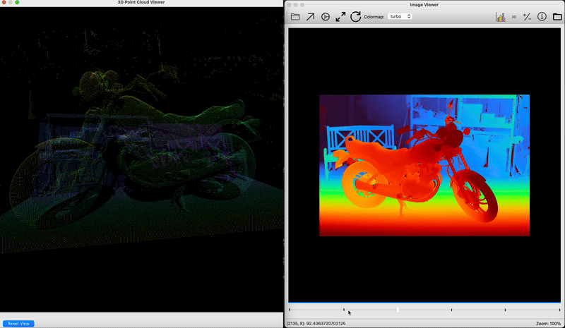

# ImageViewer: A Professional Image Analysis Tool

ImageViewer is a powerful, cross-platform desktop application for viewing and analyzing scientific and standard image formats. Built with Python and PyQt6, it provides a fluid, multi-window interface packed with features designed for in-depth image comparison and analysis — from raw sensor dumps and optical-flow fields to live histograms, NumPy math transforms, and AI-powered 3D reconstruction.


<table>
  <tr>
    <td></td>
    <td></td>
  </tr>
</table>

---

## Table of Contents

- [Installation](#installation)
- [Usage](#usage)
- [Supported Formats](#supported-formats)
- [Key Features](#key-features)
- [Keyboard Shortcuts](#keyboard-shortcuts)
- [Building from Source](#building-from-source)
- [License](#license)

---

## Installation

**[Download the latest release for your OS here](https://github.com/yakirma/ImageViewer/releases)**

The application checks for new releases on launch and notifies you when an update is available.

### macOS
1. Download the `.dmg` file.
2. Open it and drag **ImageViewer** to your **Applications** folder.
3. Open "Applications", find **ImageViewer**, and double-click to launch.

### Windows
1. Download `ImageViewer_Setup.exe`.
2. Run the installer.
3. Launch **ImageViewer** from your Start Menu or Desktop.

### Linux
1. Download the `.deb` package.
2. Install it: `sudo dpkg -i ImageViewer_*.deb` (or open it with your software center).
3. Launch **ImageViewer** from your application menu.

### Running from Source

```sh
git clone https://github.com/yakirma/ImageViewer.git
cd ImageViewer
pip install -r requirements.txt
python main.py
```

Requires Python 3.9 or newer.

---

## Usage

Once installed, open any supported file by:
- **Right-clicking** it and selecting **Open With > ImageViewer**, or
- **Dragging and dropping** files onto an open ImageViewer window, or
- **Pasting** an image from the clipboard (`Ctrl+V` / `Cmd+V`), or
- Using **File > Open** (`Ctrl+O` / `Cmd+O`).

ImageViewer enforces a **single instance** by default — opening additional files routes them to the running application instead of spawning duplicates.

---

## Supported Formats

| Category | Extensions |
| :--- | :--- |
| **Standard images** | `.png`, `.jpg`, `.jpeg`, `.bmp`, `.tiff`, `.tif`, `.gif`, `.webp`, `.heic`, `.heif` |
| **Raw sensor data** | `.raw`, `.bin`, `.dat`, `.f32`, `.f16`, `.uint8`, `.u8`, `.uint16`, `.u16`, `.u10`, `.u12`, `.u14`, `.yuv`, `.nv12`, `.nv21`, `.y`, `.yuyv`, `.uyvy`, `.rgb`, `.rgba`, `.bgr`, `.bgra` |
| **Optical flow** | `.flo` (Middlebury 2-channel format) |
| **Video** | `.mp4`, `.avi`, `.mov`, `.mkv`, `.webm`, `.gif` |
| **NumPy archives** | `.npz` (multi-array files exposed via a key picker) |

Resolution and dtype for raw files are inferred from filename hints, inherited from the previously opened file, or chosen via a dialog when ambiguous.

---

## Key Features

### 1. File Exploration & Navigation
- **Smart File Explorer:** Dedicated pane with breadcrumb navigation, folder history, and advanced filtering.
- **"Hide Folders" Filter:** Toggle folder visibility to focus strictly on image files.
- **Synchronized Navigation:** Guaranteed image presentation during rapid browsing — no skipped files when arrowing through directories.
- **Context-Aware Up-Navigation:** Automatically re-selects the previously exited subfolder when you navigate up the tree.
- **Recent Files:** Quickly reopen recent files from the File menu.

### 2. Image Viewing & Raw Support
- **Wide Format Support:** Standard images, raw sensor formats, optical-flow fields, video, and NPZ archives — see [Supported Formats](#supported-formats).
- **Optical Flow Visualization:** Automatic color coding for 2-channel flow fields (`.flo` files or "RG" channel selection), with histogram-driven contrast for surfacing subtle motion.
- **Smart Raw Inheritance:** Automatically inherits resolution and dtype between similar raw files, gracefully falling back to resolution guessing on mismatches.
- **NPZ Key Picker:** Multi-array `.npz` files expose a dropdown to switch between contained arrays.
- **Drag and Drop:** Drop images directly onto the window to load them.
- **Interactive Zoom & Pan:** Smooth, cursor-centered zoom with native trackpad pinch-gesture support on macOS.
- **Multi-Window Interface:** Open independent windows (`Ctrl+N`) with robust lifecycle management.

### 3. Real-Time Analysis & Metadata
- **Live Info Pane:** Scrub rows, columns, and dtypes with immediate, frame-by-frame visual feedback — no debounce delays.
- **Channel Selector:** Isolate specific channels (R, G, B, A) or view combinations (e.g., "RG" for optical flow) via a toolbar dropdown.
- **Live Histogram:** Dockable histogram updates in real time. Performance-optimized to skip processing when hidden.
- **Interactive Contrast Stretching:** Drag histogram bars or apply presets (Min-Max with `M`, 5%–95% percentiles with `Shift+M`). Hold `Alt` to compute the stretch from the **visible viewport only**.
- **Math Transforms:** Apply NumPy expressions to image data (e.g., `np.log(x)`, `x ** 0.5`) via a dedicated pane with smart resizing.
- **Colormaps:** Apply standard colormaps like `viridis`, `turbo`, or `magma` to single- or multi-channel data.

### 4. Comparison View (Montage)
- **Thumbnail Pane:** Dockable pane showing every image across every window.
  - **Master Image List:** All images from all windows in one place.
  - **Visual Selection State:** Selected images (blue border) appear in the montage; unselected images stay in the list.
  - **Toggle Selection:** Click thumbnails to select/deselect, or use the "Select All" checkbox.
  - **Keyboard Navigation:** Arrow keys to browse, `Enter`/`Space` to toggle.
  - **Focus Indicator:** Yellow border highlights the current keyboard focus position.
- **Montage Layout:** Compare multiple images side-by-side in a synchronized grid.
- **Synchronized Viewport:** Zoom and pan instantly mirror across all images in the montage.
- **Synchronized Crosshair:** Press `C` to toggle crosshairs and read per-image pixel values from the status bar.
- **Smart Overlays:** Overlay images preserve every modification (colormap, contrast, math transforms) from their source windows.

### 5. Copy / Paste View State
- **Copy View State** (`Ctrl+C` / `Cmd+C`): Copies the current zoom, pan, and contrast configuration as JSON to the system clipboard. Robust across images: contrast is stored as percentiles so it adapts when pasted onto a different image.
- **Copy Image** (`Ctrl+Shift+C` / `Cmd+Shift+C`): Copies the rendered image (with current colormap and contrast applied) to the clipboard.
- **Paste** (`Ctrl+V` / `Cmd+V`): Paste a clipboard image into ImageViewer, or paste a previously copied view state to instantly mirror another window's view.

### 6. Video Playback
- **Native Video Support:** Opens standard video formats just like images.
- **Frame-by-Frame Control:** Scrub frames with the slider, play/pause, or step continuously.
- **Persistent Edits:** Apply zoom, pan, contrast, or math transforms to a running video — every frame updates in real time while preserving your modifications.
- **Keyboard Navigation:** `Left`/`Right` arrows step backward/forward by one frame.

### 7. 3D Visualization (Point Cloud)
- **3D Surface View:** Visualize any single-channel 2D image as a 3D terrain where pixel intensity represents height.
- **Live Synchronization:** The 3D view updates instantly when math transforms or new data arrive.
- **Hardware Acceleration:** OpenGL-backed rendering for smooth interaction with large datasets.
- **Interaction:**
  - **Rotate:** Left-click drag.
  - **Pan:** Middle-click drag.
  - **Zoom:** Scroll wheel.
  - **Reset:** Dedicated button to restore default view.
- **Optimized Rendering:** Large images are automatically downsampled to maintain responsive frame rates without losing structural context.

### 8. AI Depth Estimation (Depth Anything 3)
- **One-Click Depth Maps:** Generate per-pixel depth from any standard image or video using [Depth Anything 3](https://github.com/ByteDance-Seed/depth-anything-3).
- **Model Selection:** Choose between `DA3-SMALL`, `DA3-BASE`, `DA3-LARGE`, and `DA3-GIANT` to trade off speed for accuracy.
- **Companion Files:** The generated depth map is saved alongside the source as a 32-bit TIFF and can be opened directly into the 3D viewer.
- **Optional Dependency:** PyTorch and the Depth Anything package are installed on demand to keep the base installer small.

---

## Keyboard Shortcuts

| Shortcut | Action |
| :--- | :--- |
| `Ctrl+N` / `Cmd+N` | Open a new ImageViewer window. |
| `Ctrl+O` / `Cmd+O` | Open file dialog. |
| `Ctrl+V` / `Cmd+V` | Paste image or view state from clipboard. |
| `Ctrl+C` / `Cmd+C` | Copy current view state (zoom, pan, contrast) as JSON. |
| `Ctrl+Shift+C` / `Cmd+Shift+C` | Copy rendered image to clipboard. |
| `M` | Apply Min-Max contrast stretch. |
| `Shift+M` | Apply 5%–95% percentile contrast stretch. |
| `Alt+M` / `Alt+Shift+M` | Same as above, computed from the visible viewport only. |
| `C` | Toggle synchronized crosshair (active image or full montage). |
| `V` | Cycle filename overlay (off → basename → full path). |
| `Backspace` | Navigate up one folder level in the File Explorer. |
| `Enter` / `Space` | Open file or toggle thumbnail selection. |
| `Arrow Up/Down` | Navigate files or thumbnails. |
| `Arrow Left/Right` | Previous/next video frame (in video mode). |
| `Pinch / Scroll` | Zoom in/out (Mac trackpad supported). |

---

## Building from Source

Build artifacts are placed in `dist/`.

| Platform | Command | Output |
| :--- | :--- | :--- |
| Cross-platform | `python build.py` | Frozen application bundle |
| macOS / Linux | `./build.sh` | `.dmg` (macOS) or `.deb` (Linux) |
| Windows | `build.bat` | NSIS installer (when `makensis` is on `PATH`) |

The `ImageViewer.spec` file drives PyInstaller and contains the platform-specific bundle metadata, file associations, and icon configuration.

---

## License

Released under the [MIT License](LICENSE).